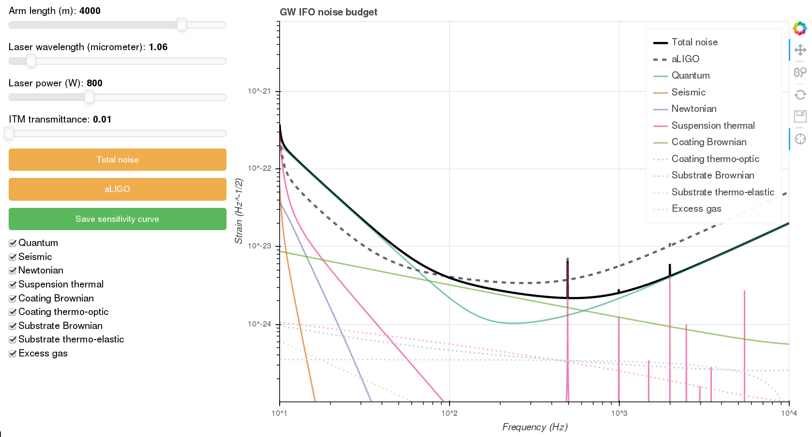

# Interactive sensitivity curve visualization for gravitational-wave detectors

The aim of this project is to provide a quick, easy and interactive tool to visualize the noise budget of interferometric gravitational-wave detectors. At this stage of the deveopment, the following four parameters of the detector can be changed interactively:

 - `Arm length`
 - `Laser wavelength`
 - `Laser power`
 - `ITM transmittance`

## Usage

### Dependencies

The interactive visualization tool uses `pygwinc` (https://git.ligo.org/gwinc/pygwinc) to generte the sensitivity curve and `bokeh` (https://docs.bokeh.org/en/latest/index.html) to visualize it.

#### Configuration

Before the first usage of `SC_interactive.py` please run the `configure.sh` shell script to give the following pieces of information:
- Location of your `pygwinc` repository
- Name of your new detector

#### Running

After installing `pygwinc` and `bokeh` and configuring the code properly, you can run it from the terminal:
~~~~
bokeh serve SC_interactive.py
~~~~

You can interact with the simulation using your web browser by navigating to: http://localhost:5006/SC_interactive

You can save the sensitivity curve to a simple text file containing the frequencies and the strain values. The data will be saved under the following folder inside your `pygwinc` directory: 
**gwinc/ifo/NameOfYourDetector**
where NameOfYourDetector is the name you have specified during the configuration.

## Simplified tool

`SC_simple.py` is a simplified tool to get the sensitivity curve without any visualization. To use it, you'll still need `pygwinc`, but it does not require `bokeh`. For this tool, there is no need for running the `configure.sh` script. The tool takes the following arguments:

| Name        | Type           | Description  |  Unit | Default value |
| ------------- |:-------------:| ------------- | ------------ |  ---------- |
| `-g, --pygwinc` | PATH | Absolute path of your pygwinc directory |  |
| `-i, --ifo` | STR | Name of your interferometer |  |
| `-l, --length` | INT | Arm length of your detector | m | 4000 |
| `-w, --wavelength` | FLOAT | Laser wavelength | nm | 1.064 |
| `-p, --power` | INT | Laser power | W | 125 |
| `-t, --transmittance` | FLOAT | ITM transmittance |  | 0.014 |
| `--f0` | FLOAT | Start frequency | Hz | 1 |
| `--f1` | FLOAT | End frequency | Hz | 10,000 |
| `-n, --numberofbins` | INT | Number of frequency bins |  | 10,000 |
| `-L, --linlog` | STR | Type of frequency spacing, i.e. `lin` for linear, `log` for logarithmic |  | lin |
| `-o, --outputdir` | PATH | Output directory |  | .

An example of how to run the simplified tool from the command line:
~~~~
python SC_simple.py --pygwinc /home/dalyag/Documents/Research/GW/High-frequency/gwinc/pygwinc \
                    --ifo MyInterferometer \
                    -l 3000 \
                    -p 500 \
                    --linlog log
~~~~

## Acknowledgement

This visualization tool is developed by G. Dálya. Please send your questions, comments and feature requests to `dalyag@caesar.elte.hu`.

