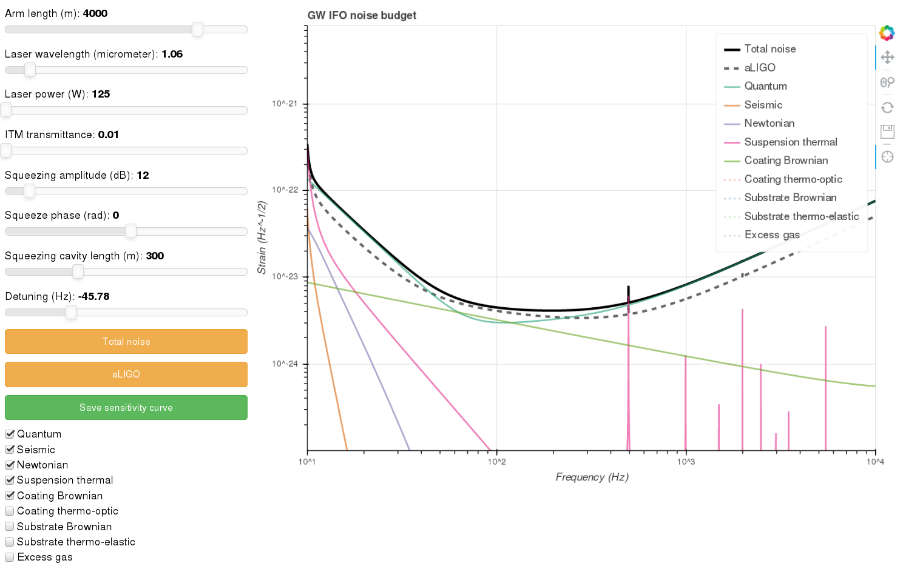

# Interactive sensitivity curve visualization for gravitational-wave detectors

The aim of this project is to provide a quick, easy and interactive tool to visualize the noise budget of interferometric gravitational-wave detectors. At this stage of the deveopment, the following four parameters of the detector can be changed interactively:

 - `Arm length`
 - `Laser wavelength`
 - `Laser power`
 - `ITM transmittance`

## Usage

### Dependencies

The interactive visualization tool uses `pygwinc` (https://git.ligo.org/gwinc/pygwinc) to generte the sensitivity curve and `bokeh` (https://docs.bokeh.org/en/latest/index.html) to visualize it.

#### Configuration

Before the first usage please run the `configure.sh` shell script to give the following pieces of information:
- Location of your `pygwinc` repository
- Name of your new detector

#### Running

After installing `pygwinc` and `bokeh` and configuring the code properly, you can run it from the terminal:
~~~~
bokeh serve SC_interactive.py
~~~~

You can interact with the simulation using your web browser by navigating to: http://localhost:5006/SC_interactive

You can save the sensitivity curve to a simple text file containing the frequencies and the strain values. The data will be saved under the following folder inside your `pygwinc` directory: 
**gwinc/ifo/NameOfYourDetector**
where NameOfYourDetector is the name you have specified during the configuration.

## Acknowledgement

This visualization tool is developed by G. Dálya. Please send your questions, comments and feature requests to `dalyag@caesar.elte.hu`.

